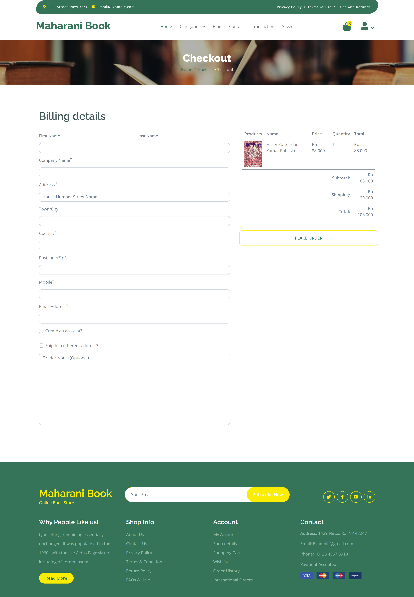
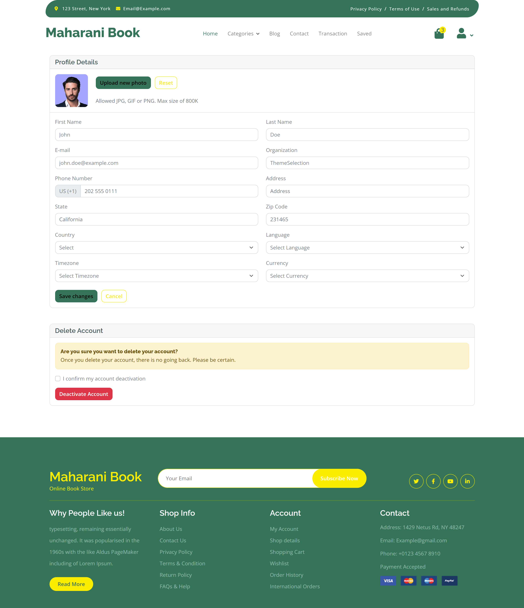

# Nama : Anisa Maharani
# NIM : 434221034
# Mata Kuliah : Workshop Desain UI/UX

Proyek Website Berdasarkan User Persona (Andi)

Judul Proyek : Sistem Informasi "Maharani Book" - Website Penjualan Buku Online
Deskripsi :
Maharani Book merupakan proyek sistem informasi penjualan buku berbasis website yang dibuat untuk memenuhi tugas akhir dari mata kuliah Workshop Desain UI. Proyek ini bertujuan untuk memberikan solusi digital yang mempermudah proses jual beli buku secara online, serta mengintegrasikan fitur-fitur yang mendukung pengalaman pengguna yang optimal.

Maharani Book memiliki beberapa halaman yang diperuntukkan untuk admin dan   customer diantaranya :

- Login
- Landing Page
- Profil
- Katalog Produk
- Detail Produk
- Keranjang
- Pembayaran
- Histori Transaksi
- Arsip Artikel
- Artikel
- Detail Artikel

- Login
- Dashboard
- Profil
- Kelola Artikel
- Kelola Produk
- Kelola Pengguna
- Kelola Transaksi

Link template Customer
https://themewagon.github.io/fruitables/

Link template Admin
https://demos.themeselection.com/sneat-bootstrap-html-admin-template-free/html/
